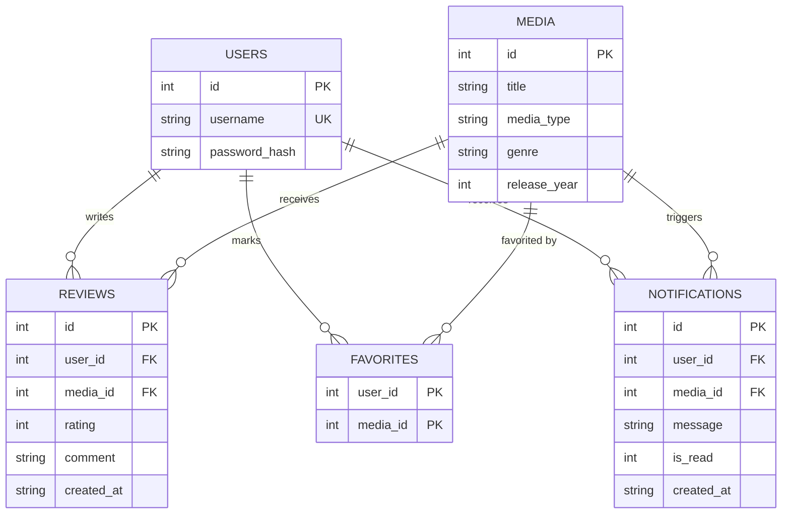
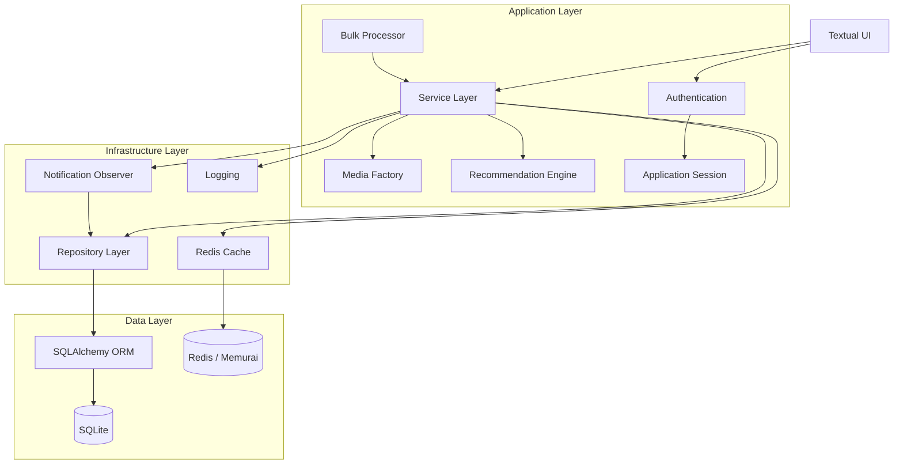
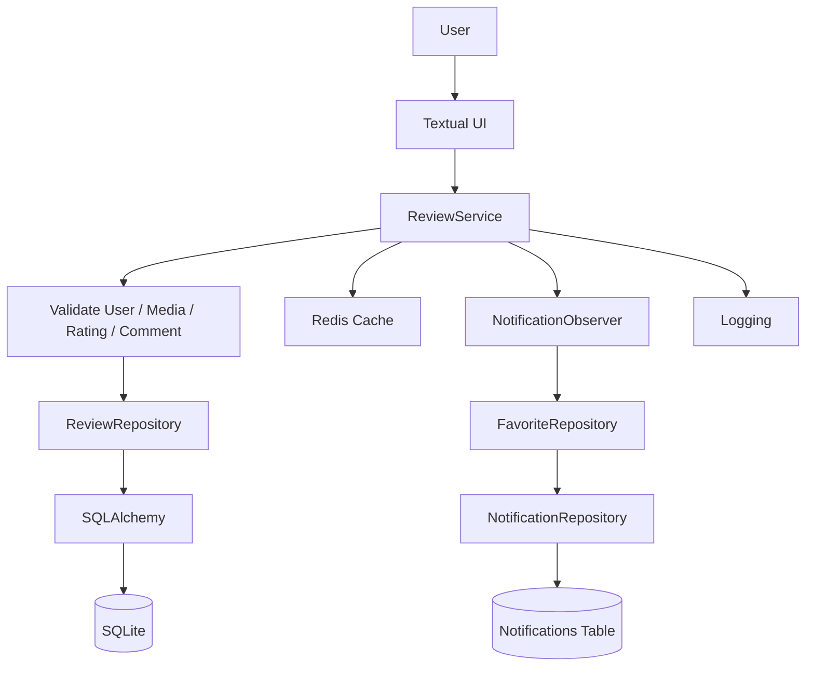
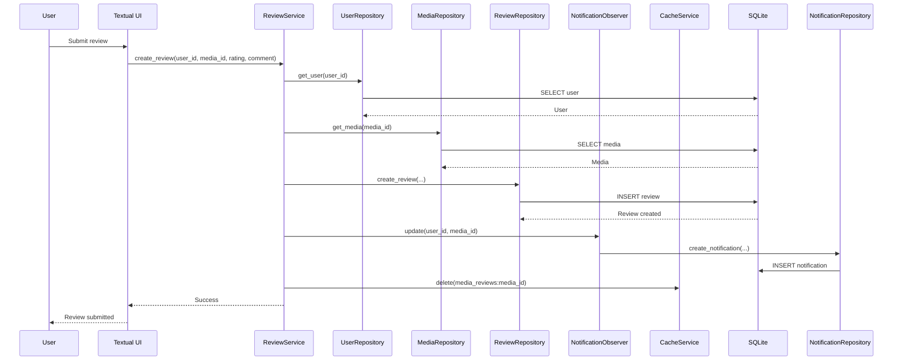
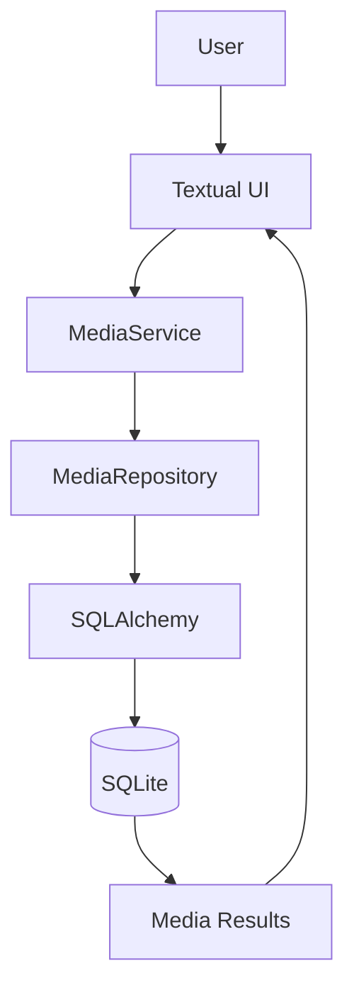
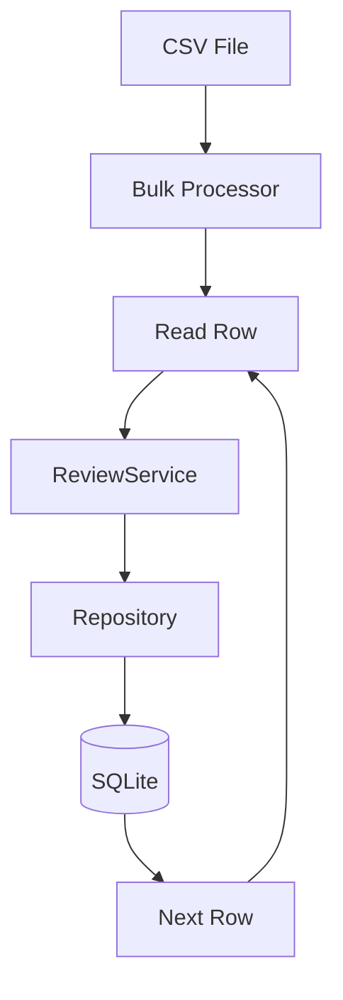
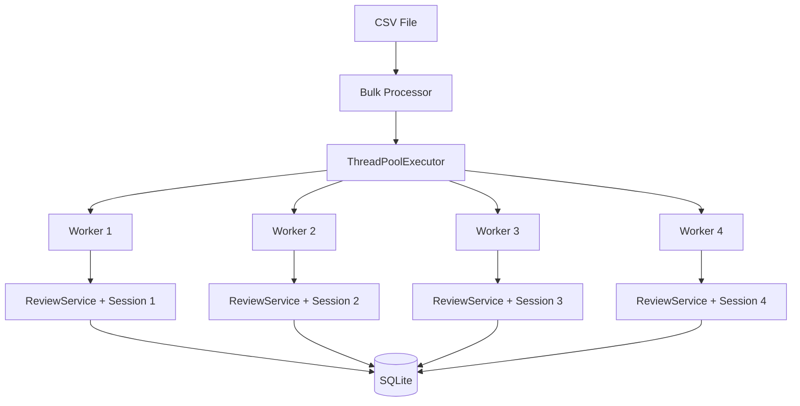
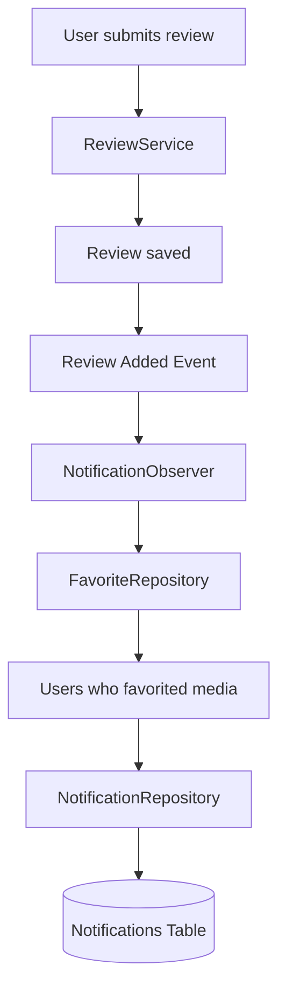
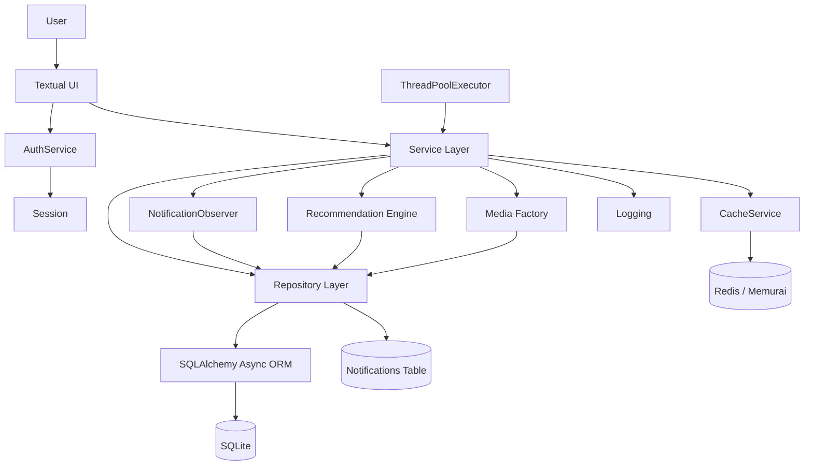

# Media Review System — Design Document

## 1. Project Overview

The **Media Review System** is a terminal-based application for reviewing and discovering media such as:

- Movies
- Web Shows
- Songs

Users can create accounts, authenticate, browse and search media, submit ratings and reviews, mark media as favorites, view highly rated media, receive personalized recommendations, and view notifications.

The project is developed in two product versions:

### V1 — Basic Working Product

V1 focuses on a clean working MVP using Python, SQLite, SQLAlchemy, Python `logging`, `pytest`, and Git.

V1 includes:

- User management
- Media management
- Reviews and ratings
- Search
- Top-rated media
- Favorites
- Bulk review import
- Bayesian/weighted recommendations
- Genre-based preference scoring
- Async database operations
- Logging
- Unit testing

### V2 — Enhanced Product

V2 improves the same product and keeps the same core ER diagram and layered architecture.

V2 adds:

- Factory Pattern for media creation
- Redis caching
- Cache invalidation
- Observer Pattern for notifications
- Multithreaded bulk review processing
- Enhanced recommendation scoring
- bcrypt password hashing
- Authentication
- Application session management
- Textual terminal UI
- Additional testing and integration

The key design principle is:

> **V2 improves V1 instead of replacing V1.**

---

## 2. Goals

The project demonstrates practical use of:

1. Python application development
2. Relational database design
3. SQLAlchemy ORM
4. Async database access
5. Layered architecture
6. Factory Pattern
7. Observer Pattern
8. Caching
9. Concurrency
10. Recommendation algorithms
11. Authentication and session management
12. Logging and error handling
13. Unit testing
14. Git development practices

---

# 3. Functional Requirements

## 3.1 User Management

The system supports:

- Create users
- Find and validate users
- Store usernames uniquely
- Store password hashes
- Login using username and password
- Logout
- Maintain a simple application session

Passwords are hashed using `bcrypt` and are never stored as plain text.

The current session is maintained in memory for the running application process.

---

## 3.2 Media Management

The system supports:

- Movies
- Web Shows
- Songs

Each media item contains:

- ID
- Title
- Media type
- Genre
- Release year

V2 uses the **Factory Pattern** to centralize media object creation.

---

## 3.3 Reviews

Users can submit reviews containing:

- Rating from 1 to 5
- Comment
- Creation timestamp
- User reference
- Media reference

Validation includes:

- User must exist
- Media must exist
- Rating must be between 1 and 5
- Comment must not be empty

A unique constraint on `(user_id, media_id)` enforces one review per user per media item.

---

## 3.4 Favorites

Users can mark media as favorites.

The `FAVORITES` table uses a composite primary key:

```text
(user_id, media_id)
```

Therefore, the same user cannot favorite the same media item more than once.

Favorites are also used by the notification Observer to determine which users should receive review notifications.

---

## 3.5 Search

Users can search media by title.

Search is handled through:

```text
Textual / argparse
        ↓
MediaService
        ↓
MediaRepository
        ↓
SQLAlchemy
        ↓
SQLite
```

---

## 3.6 Top Rated

The system provides highly rated media.

The project uses weighted/Bayesian scoring rather than relying only on a simple average.

This prevents an item with a very small number of ratings from automatically dominating the ranking.

---

## 3.7 Recommendations

The system provides personalized recommendations.

### V1 — Bayesian Recommendation

The recommendation engine is implemented directly in the project using a Bayesian/weighted-rating approach.

```text
Weighted Rating =
(v / (v + m)) × R
+
(m / (v + m)) × C
```

Where:

- `R` = average rating of the media item
- `v` = number of ratings for the media item
- `C` = overall average rating across media
- `m` = minimum number of ratings used as the confidence threshold

The V1 recommendation score is enhanced with user preference information such as:

- Genre preferences
- Media-type preferences

Already-reviewed media is excluded from recommendations.

### V2 — Enhanced Recommendation

The implemented V2 recommendation engine enhances the Bayesian score with additional user preference signals.

The current implementation does **not** claim a separate collaborative-filtering or external recommendation-library implementation.

The effective flow is:

```text
User Review History
        +
Genre Preferences
        +
Media-Type Preferences
        +
Bayesian / Weighted Rating
        |
        v
Enhanced Recommendation Score
        |
        v
Ranked Recommendations
```

---

# 4. Non-Functional Requirements

## Maintainability

Business logic is separated from UI and database access through service and repository layers.

## Reliability

Invalid input and individual bulk-review failures should not unnecessarily terminate the complete application.

## Performance

Frequently accessed review data is cached in Redis in V2.

Bulk reviews can be processed concurrently using `ThreadPoolExecutor`.

## Extensibility

New media types can be introduced through the Factory Pattern without spreading media-specific creation logic across the application.

## Testability

Business logic is testable independently from the UI.

## Observability

Important operations and failures are recorded using Python logging.

## Security

Passwords are hashed using bcrypt and passwords are not written to application logs.

## Version Control

Development is represented through meaningful Git commits for major features.

---

# 5. Technology Stack

| Area | Technology |
|---|---|
| Language | Python |
| Terminal UI | Textual |
|
| Database | SQLite |
| ORM | SQLAlchemy 2.x |
| Async SQLite Driver | aiosqlite |
| Cache | Redis |
| Windows Redis-compatible Server | Memurai |
| Concurrency | ThreadPoolExecutor |
| Password Hashing | bcrypt |
| Logging | Python `logging` |
| Testing | pytest / pytest-asyncio |
| Version Control | Git |

---

# 6. Database Design

The database contains five main entities:

1. USERS
2. MEDIA
3. REVIEWS
4. FAVORITES
5. NOTIFICATIONS

The same ER model is maintained across V1 and V2.

## 6.1 ER Diagram



## 6.2 ER Diagram Explanation

### USERS → REVIEWS

One user can write multiple reviews. Each review belongs to one user.

### MEDIA → REVIEWS

One media item can receive multiple reviews.

Therefore, Users and Media have a many-to-many relationship through Reviews.

### USERS → FAVORITES

One user can favorite multiple media items.

### MEDIA → FAVORITES

One media item can be favorited by multiple users.

`FAVORITES` acts as the mapping table between Users and Media.

### USERS → NOTIFICATIONS

One user can receive multiple notifications.

### MEDIA → NOTIFICATIONS

A notification is associated with the media item that triggered the event.

---

# 7. High-Level Design (HLD)

## 7.1 HLD Overview

The system follows a layered architecture.

The main request path is:

```text
Textual UI
        |
        v
Service Layer
        |
        v
Repository Layer
        |
        v
SQLAlchemy ORM
        |
        v
SQLite
```

V2 adds supporting components around the core flow:

```text
                         Textual UI
                                |
                                v
                         Service Layer
                         /    |    |    \
                        /     |    |     \
                       v      v    v      v
                  Factory   Cache Observer Recommendation
                              |      |
                              v      v
                            Redis  Notifications

                         Bulk Processing
                                |
                                v
                       ThreadPoolExecutor
                                |
                                v
                           Service Layer
```

## 7.2 HLD Architecture Diagram



## 7.3 HLD Component Responsibilities

### UI

The Textual UI is the application's presentation layer.

Responsible for:

- Accepting user input
- Displaying results
- Displaying errors
- Displaying notifications
- Triggering application services

The Textual UI is the application's terminal interface.

### Service Layer

Responsible for:

- Business validation
- Review creation
- Media operations
- Favorite operations
- Authentication coordination
- Recommendation coordination
- Cache coordination
- Observer notification coordination

### Repository Layer

Responsible for:

- User data access
- Media data access
- Review data access
- Favorite data access
- Notification data access

### SQLAlchemy

Provides the ORM and asynchronous database access between repositories and SQLite.

### Redis Cache

Stores frequently accessed review data using a cache-aside strategy.

### Observer

Responds to newly created reviews and creates notification records for users who favorited the relevant media.

### Thread Pool

Processes multiple bulk-review rows concurrently. Each worker uses its own database session.

### Recommendation Engine

Calculates and ranks recommendation scores using Bayesian rating information and user preference signals.

### Authentication

Validates username/password credentials using bcrypt.

### Session

Maintains the authenticated user's ID and username in memory for the running application process.

---

# 8. Low-Level Design (LLD)

## 8.1 LLD Overview

The LLD describes the concrete modules, classes, methods, data flow, and interactions used to implement the HLD.

The application is organized into Python modules under `app/`.

```text
app/
├── db.py
├── models.py
├── repo.py
├── services.py
├── recommendation.py
├── bulk.py
├── cache.py
├── auth.py
├── session.py
├── ui.py
├── logging_config.py
├── media/
└── observers/
```

---

## 8.2 Database Layer — `app/db.py`

Responsibilities:

- Create the asynchronous SQLAlchemy engine
- Configure `AsyncSession`
- Provide `AsyncSessionLocal`
- Create database tables

Database URL:

```text
sqlite+aiosqlite:///data/media_review.db
```

The application uses:

```text
create_async_engine()
async_sessionmaker()
AsyncSession
```

For concurrent bulk workers, a separate session is created for each worker.

---

## 8.3 Model Layer — `app/models.py`

Main ORM models:

```text
User
Media
Review
Favorite
Notification
```

Relationships:

```text
User 1 ---- * Review
Media 1 ---- * Review

User 1 ---- * Favorite
Media 1 ---- * Favorite

User 1 ---- * Notification
Media 1 ---- * Notification
```

Important constraints:

```text
User.username → UNIQUE

Review(user_id, media_id) → UNIQUE

Favorite(user_id, media_id) → COMPOSITE PRIMARY KEY
```

---

## 8.4 Repository Layer — `app/repo.py`

Repositories isolate SQLAlchemy queries from business logic.

### UserRepository

Responsibilities:

- Create user
- Find user by ID
- Find user by username

Important method:

```text
get_user_by_username(username)
```

### MediaRepository

Responsibilities:

- Create media
- Find media
- Retrieve all media
- Search media

### ReviewRepository

Responsibilities:

- Create review
- Retrieve reviews for media
- Retrieve top-rated media
- Retrieve rating statistics
- Retrieve global rating statistics
- Retrieve user genre ratings
- Retrieve user-reviewed media IDs
- Retrieve user media-type ratings

### FavoriteRepository

Responsibilities:

- Add favorite
- Retrieve user favorites
- Retrieve users who favorited a media item

### NotificationRepository

Responsibilities:

- Create notification
- Retrieve user notifications

---

# 9. Service Layer Design

## 9.1 UserService

Responsibilities:

- Validate username
- Validate password
- Hash password using bcrypt
- Create users

Flow:

```text
Create User
    |
    v
Validate Input
    |
    v
bcrypt Hash
    |
    v
UserRepository
    |
    v
SQLite
```

## 9.2 AuthService

Responsibilities:

- Validate login input
- Find user by username
- Verify password using bcrypt
- Return authenticated user

Flow:

```text
Username + Password
        |
        v
UserRepository
        |
        v
User Found?
   /          \
 No           Yes
 |             |
Error      bcrypt.checkpw()
               |
          Match?
          /    \
        No      Yes
        |        |
      Error    User
```

## 9.3 Session

The session is an in-memory application object.

Typical state:

```text
user_id
username
```

It provides operations equivalent to:

```text
login(user)
logout()
is_authenticated
```

Sessions are process-local. Two separately running terminal processes have separate session objects while sharing the same persistent SQLite database.

---

## 9.4 MediaService

Responsibilities:

- Validate media input
- Use `MediaFactory`
- Create media through `MediaRepository`
- List media
- Search media

---

## 9.5 ReviewService

Responsibilities:

- Validate review data
- Verify user
- Verify media
- Create review
- Trigger observers
- Invalidate review cache
- Retrieve cached or database reviews
- Retrieve top-rated media

Review creation flow:

```text
create_review()
      |
      v
Validate rating/comment
      |
      v
Verify user
      |
      v
Verify media
      |
      v
Repository.create_review()
      |
      +--------> Observer notification
      |
      +--------> Redis cache invalidation
      |
      v
Return created review
```

---

## 9.6 FavoriteService

Responsibilities:

- Validate user
- Validate media
- Add favorites
- Retrieve favorites

---

# 10. Factory Pattern — LLD

V2 uses the Factory Pattern for media creation.

Classes:

```text
Media
 |
 +-- Movie
 +-- WebShow
 +-- Song

MediaFactory
```

Flow:

```text
MediaService
     |
     v
MediaFactory.create_media()
     |
     +---- movie ----> Movie
     |
     +---- web_show -> WebShow
     |
     +---- song -----> Song
```

The service does not need to directly instantiate every media subtype.

This keeps media creation centralized and makes future media types easier to add.

---

# 11. Redis Cache — LLD

The cache is implemented in `app/cache.py`.

The cache uses:

```text
CacheService
```

Operations:

```text
get(key)
set(key, value)
delete(key)
close()
```

Configuration includes:

```text
Host: localhost
Port: 6379
TTL: 300 seconds
```

Review cache key:

```text
media_reviews:<media_id>
```

Example:

```text
media_reviews:2
```

### Cache Read

```text
ReviewService.get_reviews(media_id)
          |
          v
CacheService.get()
       /       \
    HIT         MISS
     |            |
     v            v
Return       ReviewRepository
cached            |
data              v
              SQLite
                 |
                 v
              Cache.set()
                 |
                 v
              Return
```

### Cache Invalidation

After a successful new review:

```text
Review created
      |
      v
delete(media_reviews:<media_id>)
```

This prevents stale review data from remaining in the cache after a write.

---

# 12. Observer Pattern — LLD

The Observer implementation is located in:

```text
app/observers/
├── base.py
└── notification.py
```

## ReviewObserver

Defines the observer interface:

```text
update(user_id, media_id)
```

## NotificationObserver

Uses:

```text
FavoriteRepository
NotificationRepository
```

When a review is added:

```text
ReviewService
      |
      v
NotificationObserver.update()
      |
      v
FavoriteRepository
      |
      v
Users who favorited media
      |
      v
NotificationRepository
      |
      v
Notifications table
```

The reviewer is excluded from receiving their own review notification.

Redis Pub/Sub is not used.

---

# 13. Multithreaded Bulk Processing — LLD

Bulk processing is implemented in:

```text
app/bulk.py
```

The system reads:

```text
media_id,rating,comment
```

from a CSV file.

For multiple rows:

```text
CSV
 |
 v
Bulk Processor
 |
 v
ThreadPoolExecutor
 |
 +---- Worker 1
 |
 +---- Worker 2
 |
 +---- Worker 3
 |
 +---- Worker 4
```

Each worker creates its own:

```text
AsyncSession
ReviewRepository
UserRepository
MediaRepository
FavoriteRepository
NotificationRepository
CacheService
NotificationObserver
ReviewService
```

This avoids sharing one `AsyncSession` between concurrent workers.

The workers process reviews independently and return success/failure information.

The final result is:

```text
Successful: X
Failed: Y
```

A single-row bulk operation can use the caller's existing service/session, while multi-row processing uses independent worker sessions.

---

# 14. Recommendation Engine — LLD

The recommendation implementation is located in:

```text
app/recommendation.py
```

The engine receives review and media repositories.

It retrieves:

- User review history
- User genre ratings
- User media-type ratings
- Media rating statistics
- Candidate media

Already-reviewed media is removed from the candidate set.

The scoring process is:

```text
Candidate Media
      |
      v
Bayesian Weighted Score
      |
      +---- Genre Preference
      |
      +---- Media-Type Preference
      |
      v
Enhanced Score
      |
      v
Sort Descending
      |
      v
Top-N Recommendations
```

---

# 15. Logging Design

Logging is a cross-cutting concern.

The logging configuration is implemented in:

```text
app/logging_config.py
```

Log file:

```text
logs/media_review.log
```

Important events include:

- Application startup
- Review creation
- Cache hit
- Cache miss
- Cache invalidation
- Bulk review success
- Bulk review failure
- Recommendation generation
- Validation failures
- Database failures
- Notification creation

Passwords are never logged.

---

# 16. High-Level Review Submission Flow



---

# 17. Low-Level Review Submission Sequence



---

# 18. Search Data Flow



Search is currently database-backed. The Redis cache is focused on frequently accessed review data rather than all media searches.

---

# 19. Bulk Review Data Flow

## V1 — Sequential



## V2 — Concurrent



Each worker operates independently.

---

# 20. Notification Data Flow



---

# 21. Textual UI Design

The Textual UI is the primary and current application entry point.

The Textual UI is implemented in:

```text
app/ui.py
```

The UI provides:

- Login
- Logout
- Create User
- Add Media
- List Media
- Search Media
- Top Rated
- Add Review
- View Reviews
- Add Favorite
- View Favorites
- Recommendations
- Notifications
- Bulk Review CSV import

The UI delegates business operations to services instead of performing database queries directly.

Run:

```powershell
python -m app.ui
```

---

# 22. Error Handling

The system handles:

- Empty username
- Empty password
- Invalid credentials
- Invalid media ID
- Invalid user ID
- Invalid media type
- Invalid release year
- Invalid rating
- Empty review comments
- Duplicate reviews
- Duplicate favorites
- Invalid bulk-review rows
- Database constraint errors
- Redis/cache errors
- Unexpected application errors

User-facing errors are kept clear.

Technical details are recorded in logs where appropriate.

---

# 23. Testing Strategy

Tests are maintained under:

```text
test/
```

The test suite covers:

### Authentication

- Successful login
- Wrong password
- Unknown user
- Empty username
- Empty password

### Sessions

- Login state
- Logout state
- Authentication state

### Repository

- Create/read operations
- Search
- Review retrieval
- Rating statistics
- Favorites
- Notifications

### Services

- Input validation
- User creation
- Media creation
- Review creation
- Favorite operations

### Recommendation Engine

- Bayesian score
- Ranking behavior
- User preference behavior
- Exclusion of already-reviewed media

### V2

- Factory behavior
- Redis cache hit/miss
- Cache invalidation
- Observer notification creation
- Bulk processing
- Concurrent worker handling

Run:

```powershell
python -m pytest
```

---

# 24. Project Structure

```text
MINI_PROJECT/
│
├── app/
│   ├── __init__.py
│   ├── bulk.py
│   ├── cache.py
│   ├── db.py
│   ├── logging_config.py
│   ├── models.py
│   ├── recommendation.py
│   ├── repo.py
│   ├── services.py
│   ├── auth.py
│   ├── session.py
│   ├── ui.py
│   │
│   ├── media/
│   │   ├── __init__.py
│   │   ├── base.py
│   │   ├── movie.py
│   │   ├── web_show.py
│   │   ├── song.py
│   │   └── factory.py
│   │
│   └── observers/
│       ├── __init__.py
│       ├── base.py
│       └── notification.py
│
├── test/
│   ├── conftest.py
│   ├── test_auth.py
│   ├── test_bulk.py
│   ├── test_recommendation.py
│   ├── test_repo.py
│   ├── test_services.py
│   └── test_session.py
│
├── data/
│   ├── media_review.db
│   └── reviews.csv
│
├── logs/
│   └── media_review.log
│
├── DESIGN DOC.md
├── requirments.txt
├── pytest.ini
├── .gitignore
└── README.md
```

---

# 25. Git Development Strategy

The project uses meaningful Git commits for major logical changes.

The actual development history includes:

```text
Initialize project structure
        ↓
Async SQLAlchemy database configuration
        ↓
Database models
        ↓
Repository layer
        ↓
Review retrieval and top-rated media
        ↓
V1 completion
        ↓
Media Factory Pattern
        ↓
Redis caching
        ↓
Enhanced recommendation scoring
        ↓
Observer notifications
        ↓
Multithreaded bulk review processing
        ↓
Textual UI
        ↓
Authentication and session management
        ↓
Final V2 integration
```

Each commit represents a logical change rather than an unrelated collection of edits.

---

# 26. Product Version Strategy

## V1 — Basic Working Product

```text
Database
   |
   +-- SQLite
   +-- SQLAlchemy
   |
Core Features
   |
   +-- Users
   +-- Media
   +-- Reviews
   +-- Favorites
   +-- Search
   +-- Top Rated
   +-- Bulk Review
   |
Recommendation
   |
   +-- Bayesian / Weighted Rating
   +-- Genre Preferences
   |
Engineering
   |
   +-- Logging
   +-- Tests
   +-- Git
```

V1 is represented by the Git tag:

```text
v1.0
```

## V2 — Enhanced Product

```text
V1.0
 |
 +-- Media Factory
 +-- Redis Cache
 +-- Cache Invalidation
 +-- Observer Notifications
 +-- Multithreaded Bulk Processing
 +-- Enhanced Recommendations
 +-- bcrypt Authentication
 +-- Application Sessions
 +-- Textual UI
 +-- Additional Tests
 |
v2.0
```

---

# 27. Key Design Principle

> **V2 improves V1 instead of replacing V1.**

The database model remains stable.

The core request flow remains:

```text
Presentation
     ↓
Service
     ↓
Repository
     ↓
SQLAlchemy
     ↓
SQLite
```

V2 adds capabilities around this flow:

```text
Factory
Redis Cache
Observer
Thread Pool
Enhanced Recommendation
Authentication
Session
Textual UI
```

This demonstrates how a simple working product can evolve into a more capable and production-oriented application without unnecessarily rewriting the core system.

---

# 28. Final End-to-End Architecture



---

# 29. Development Flow

```text
BUILD V1
   ↓
TEST V1
   ↓
ADD LOGGING
   ↓
CREATE MEANINGFUL GIT COMMITS
   ↓
TAG V1.0
   ↓
ADD V2 ENHANCEMENTS
   ↓
TEST EACH ENHANCEMENT
   ↓
COMMIT EACH FEATURE
   ↓
INTEGRATE V2
   ↓
RUN FINAL TEST SUITE
   ↓
TAG V2.0
```

---

# 30. Final Project Status

The implemented project contains:

- V1 MVP
- Async SQLAlchemy + SQLite
- Repository and service layers
- Bayesian recommendation engine
- Genre and media-type preference scoring
- Media Factory Pattern
- Redis review caching
- Cache invalidation
- Observer notifications
- Multithreaded bulk review processing
- bcrypt password hashing
- Authentication
- Application session management
- Textual terminal UI
- Logging
- Unit tests
- Git versioning

The final V2 milestone is represented by:

```text
v2.0
```
v