# Media Review System — Design Document

## 1. Project Overview

The **Media Review System** is a CLI-based application for reviewing and discovering media such as:

- Movies
- Web Shows
- Songs

Users can create accounts, browse/search media, submit ratings and reviews, mark media as favorites, view highly rated media, and receive personalized recommendations.

The project will be developed in **two product versions**.

### V1 — Basic Working Product

V1 focuses on a clean, functional product using Python, SQLite, SQLAlchemy, `argparse`, Python `logging`, `pytest`, and Git.

V1 includes user management, media management, reviews, search, top-rated media, favorites, bulk review import, and a Bayesian/weighted-rating recommendation approach.

### V2 — Enhanced Product

V2 improves the same product and keeps the same core ER diagram and overall architecture.

V2 adds:

- Factory Pattern for media types
- Redis caching
- Observer Pattern for notifications
- Multithreaded bulk review processing
- Enhanced recommendation using a suitable recommendation library/advanced algorithm
- Textual-based terminal UI
- Improved logging, testing, and error handling

The goal is to first build a reliable V1 and then demonstrate how the same product can be improved 

---

## 2. Goals

The project demonstrates practical use of:

1. Python application development
2. Relational database design
3. SQLAlchemy ORM
4. Layered architecture
5. Design patterns
6. Caching
7. Concurrency
8. Recommendation algorithms
9. Logging and error handling
10. Unit testing
11. Git development practices


## 3. Functional Requirements

### 3.1 User Management

- Create users
- Find/validate users
- Store usernames uniquely
- Store password hashes
- Authentication/session management may be added as a bonus

### 3.2 Media Management

The system supports:

- Movies
- Web Shows
- Songs

Each media item contains:

- ID
- Title
- Media type
- Genre
- Release year

### 3.3 Reviews

Users can submit reviews containing:

- Rating from 1 to 5
- Comment
- Creation timestamp
- User reference
- Media reference

Validation:

- User exists
- Media exists
- Rating is between 1 and 5
- Comment is not empty

A unique constraint on `(user_id, media_id)` can enforce one review per user per media item.

### 3.4 Favorites

Users can mark media as favorites.

The same user cannot favorite the same media item more than once.

### 3.5 Search

Users can search media by title.

### 3.6 Top Rated

The system should provide highly rated media.

A weighted/Bayesian rating is preferred over a simple average so that an item with very few reviews does not automatically dominate the ranking.

### 3.7 Recommendations

The system provides personalized recommendations.

#### V1 — Bayesian Recommendation

The first recommendation engine will be implemented directly in the project using a Bayesian/weighted-rating approach.

```text
Weighted Rating =
(v / (v + m)) × R
+
(m / (v + m)) × C
```

Where:

- `R` = average rating of the media item
- `v` = number of ratings for the media item
- `C` = overall average rating across media
- `m` = minimum number of ratings used as the confidence threshold

The weighted score can be combined with user preference information such as genre preferences.

#### V2 — Enhanced Recommendation

After V1 is stable, the recommendation system will be improved using a suitable recommendation library or advanced algorithm.

Possible approaches:

- Content-based recommendation
- Collaborative filtering
- Hybrid recommendation

The final approach will be selected based on the available project data and the results of the V1 implementation.

---

## 4. Non-Functional Requirements

### Maintainability
Business logic should be separated from CLI and database code.

### Reliability
Invalid input and individual bulk-review failures should be handled without unnecessarily terminating the complete application.

### Performance
Frequently accessed information can be cached in V2.

### Extensibility
New media types and functionality should be possible without major changes to existing business logic.

### Testability
Business logic should be testable independently from the CLI.

### Observability
Important operations and failures should be recorded through Python logging.

### Version Control
Development should be represented through multiple meaningful Git commits.

---

## 5. Technology Stack

| Area | Technology |
|---|---|
| Language | Python |
| CLI | argparse |
| Terminal UI | Textual (V2) |
| Database | SQLite |
| ORM | SQLAlchemy |
| Cache | Redis (V2) |
| Concurrency | ThreadPoolExecutor (V2) |
| Logging | Python `logging` |
| Testing | pytest |
| Version Control | Git |

---

# 6. Database Design

The database contains five main entities:

1. USERS
2. MEDIA
3. REVIEWS
4. FAVORITES
5. NOTIFICATIONS

The same ER model is maintained across V1 and V2.

## 6.1 ER Diagram

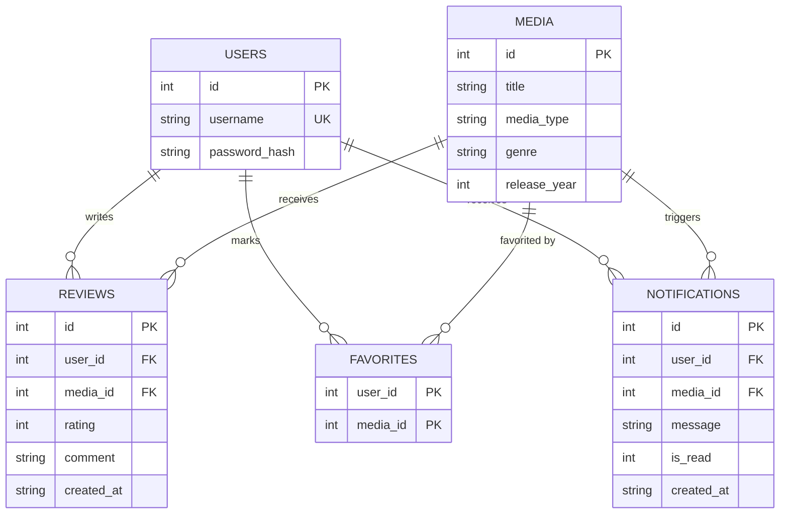

## 6.2 ER Diagram Explanation

### USERS → REVIEWS
One user can write multiple reviews. Each review belongs to one user.

### MEDIA → REVIEWS
One media item can receive multiple reviews.

Therefore, Users and Media have a many-to-many relationship through Reviews.

### USERS → FAVORITES
One user can favorite multiple media items.

### MEDIA → FAVORITES
One media item can be favorited by multiple users.

`FAVORITES` acts as the mapping table between Users and Media.

### USERS → NOTIFICATIONS
One user can receive multiple notifications.

### MEDIA → NOTIFICATIONS
A notification can be associated with the media item that triggered the event.

---

# 7. System Architecture

The system follows a layered architecture.

The main request path is:

```text
CLI / Textual
      |
      v
Service Layer
      |
      v
Repository Layer
      |
      v
SQLAlchemy
      |
      v
SQLite
```

V2 adds supporting components without changing this core flow.

## 7.1 Architecture Diagram

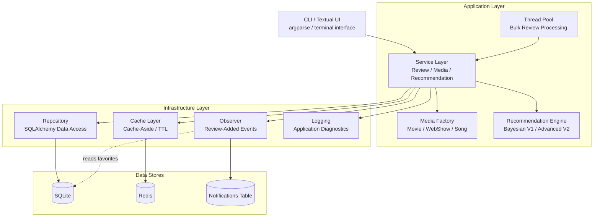

**Note:** SQLAlchemy is the ORM used between the Repository and SQLite. It is part of the Repository data-access path.

---

# 8. Architecture Responsibilities

## CLI / Textual UI

Responsible for:

- Accepting user input
- Parsing commands
- Displaying results
- Displaying errors and notifications

The UI should not contain database queries or core business logic.

V1 uses `argparse`. V2 can add Textual as a richer terminal interface.

## Service Layer

Contains business/application logic:

- Validate review requests
- Coordinate review creation
- Search media
- Calculate top-rated media
- Generate recommendations
- Coordinate favorites
- Trigger review-added events

## Repository Layer

Responsible for database operations:

- Create/find users
- Create/find media
- Create/retrieve reviews
- Retrieve favorites
- Store notifications

The Repository uses SQLAlchemy so database access is not spread throughout the application.

## SQLAlchemy

Provides the ORM layer:

```text
Python Models
     |
     v
SQLAlchemy ORM
     |
     v
SQLite
```

Core SQLAlchemy models can remain together in `models.py`.

## Recommendation Engine

### V1

```text
Bayesian / Weighted Rating
        +
User Preference
        |
        v
Recommendation Score
        |
        v
Ranked Results
```

### V2

```text
Content-Based
      +
Collaborative Filtering
      +
Bayesian / Popularity
      |
      v
Hybrid Recommendation
```

## Media Factory

V2 centralizes creation of media-specific objects:

```text
MediaFactory
    |
    +-- Movie
    +-- WebShow
    +-- Song
```

This makes future media types easier to add.

## Cache Layer

V2 introduces Redis using a cache-aside approach:

```text
Application
    |
    v
Check Redis
    |
    +---- HIT ----> Return cached data
    |
    +---- MISS ---> Database
                       |
                       v
                  Store in Redis
                       |
                       v
                     Return
```

The cache should support TTL, invalidation, and graceful fallback to SQLite if Redis is unavailable.

## Observer

V2 uses the Observer Pattern for review-related notifications:

```text
Review Added
     |
     v
Observer
     |
     v
Find users who favorited the media
     |
     v
Create Notifications
```

Redis Pub/Sub is not required.

## Thread Pool

V2 uses `ThreadPoolExecutor` for concurrent bulk review processing:

```text
CSV
 |
 v
ThreadPoolExecutor
 |
 +--> Review 1
 +--> Review 2
 +--> Review 3
 +--> Review 4
```

Database sessions/connections must be handled safely for concurrent execution.

## Logging

Logging is a cross-cutting concern used across the application.

Events to log include:

- Application startup/shutdown
- CLI operations
- Successful review creation
- Validation failures
- Database failures
- Cache hit/miss
- Recommendation generation
- Bulk review success/failure
- Notification creation

User-facing messages remain CLI/UI output; logs are for diagnostics and observability.

---

# 9. Data Flow

## 9.1 Review Submission — V1

Example:

```bash
python media_review.py --review <media_id> <rating> "<comment>"
```

Flow:

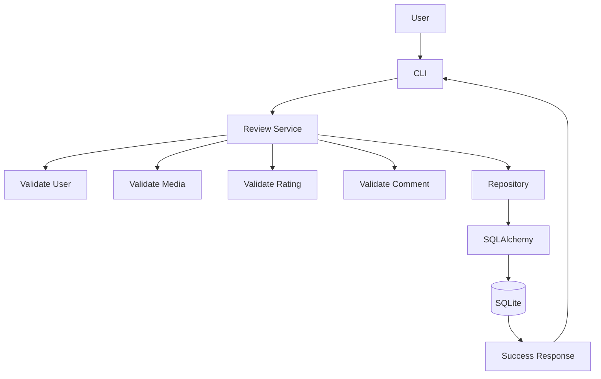

## 9.2 Review Submission — V2

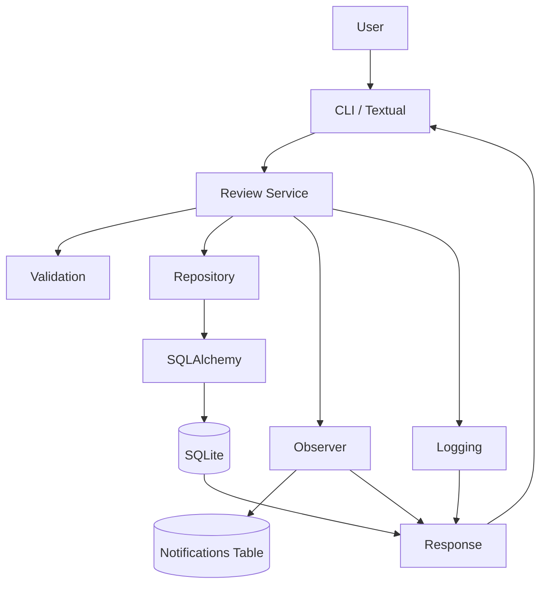

---

# 10. Search Data Flow

### V1

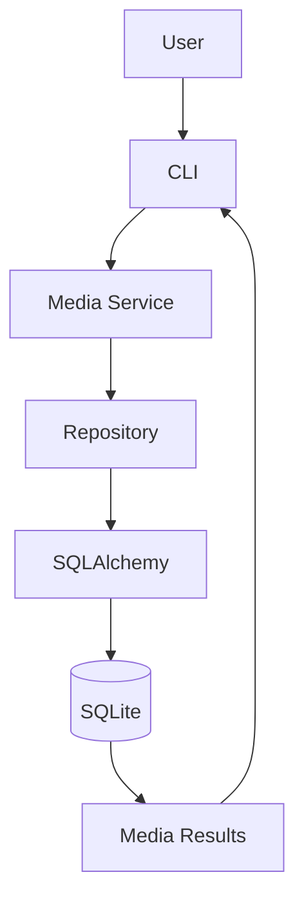

### V2

Frequently accessed data can use Redis:

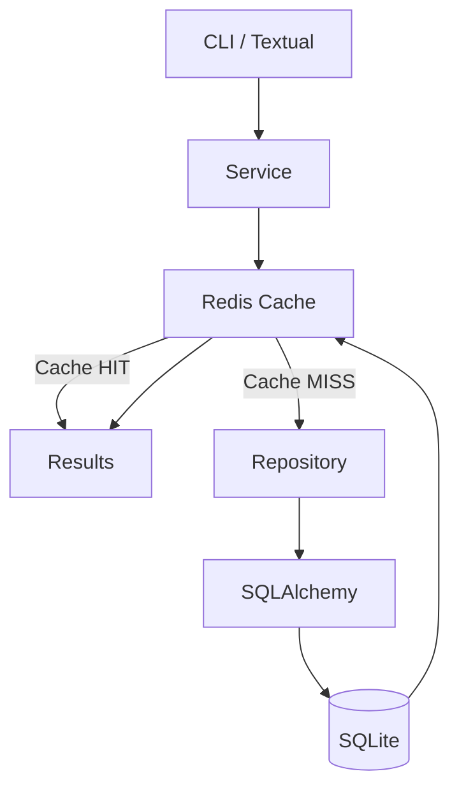

---

# 11. Recommendation Data Flow

## V1

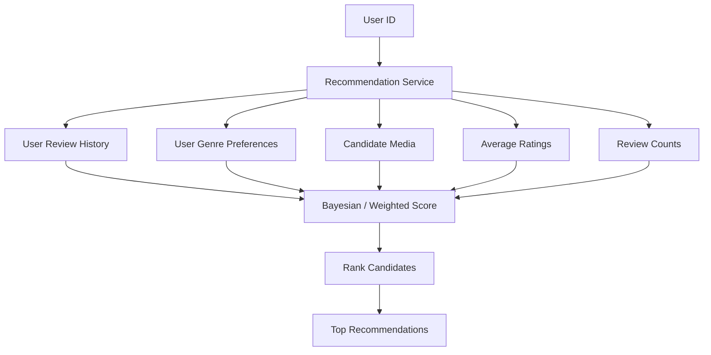

## V2

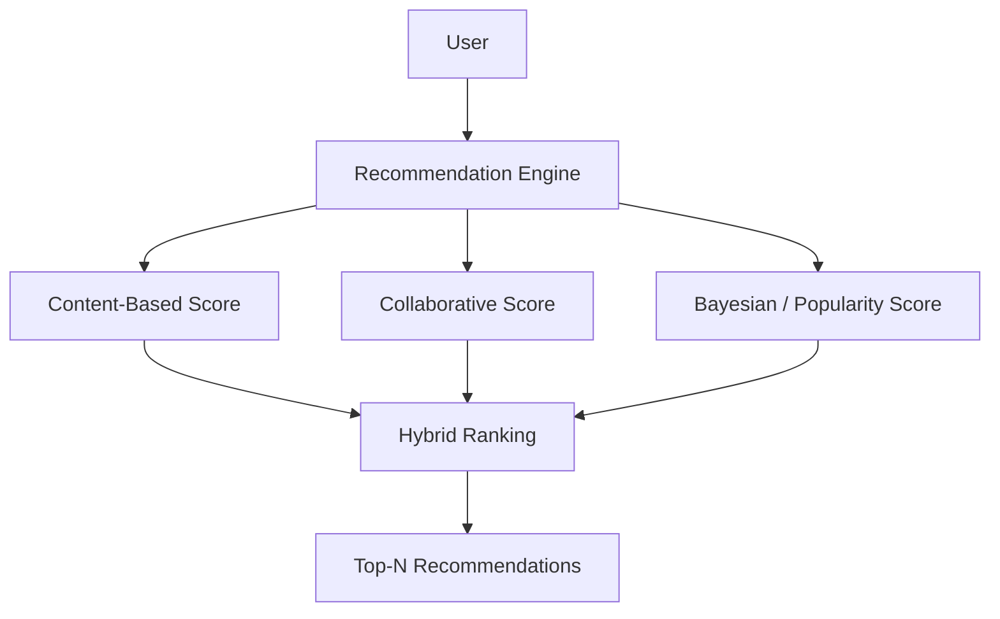

---

# 12. Bulk Review Data Flow

## V1 — Sequential

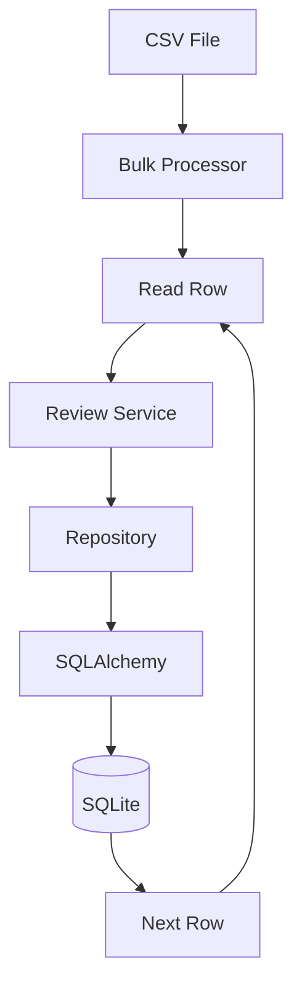

A failed row should be recorded and should not unnecessarily stop the remaining valid rows.

## V2 — Concurrent

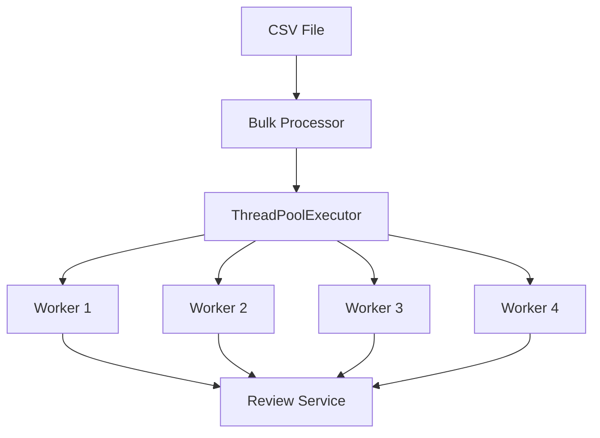

Each task is independent and failures should be isolated.

---

# 13. Notification Data Flow

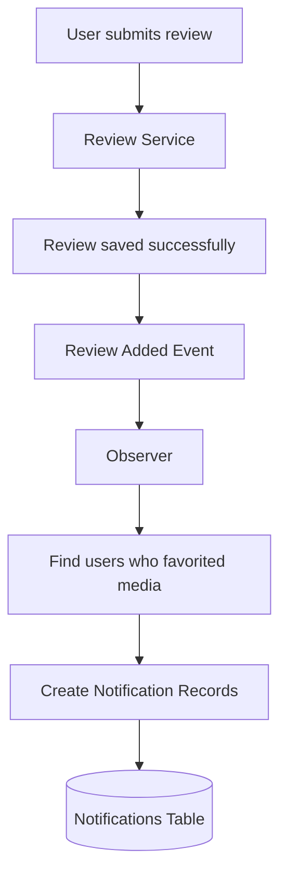

---

# 14. CLI Commands

```bash
python media_review.py --list
```

List media.

```bash
python media_review.py --review <media_id> <rating> "<comment>"
```

Submit a review.

```bash
python media_review.py --bulk-review <file_name>
```

Import reviews from a file.

Example:

```text
media_id,rating,comment
1,5,Amazing movie
2,4,Really good
3,5,Excellent
```

```bash
python media_review.py --search <title>
```

Search media by title.

```bash
python media_review.py --top-rated
```

Show top-rated media.

```bash
python media_review.py --recommend <user_id>
```

Generate recommendations.

```bash
python media_review.py --notification <media_id>
```

Display relevant notifications.

V2 may provide equivalent functionality through Textual.

---

# 15. Error Handling

The system should handle:

- Invalid command arguments
- Invalid media ID
- Invalid user ID
- Invalid rating
- Empty review comments
- Duplicate reviews
- Duplicate favorites
- Invalid bulk-review rows
- Database errors
- Redis connection failures
- Unexpected application errors

User-facing errors should be clear, while technical details should be logged.

---

# 16. Testing Strategy

Testing should be added throughout development.

### Models

- Model creation
- Relationships
- Constraints

### Repository

- Create/read operations
- Search
- Review retrieval
- Favorites
- Notifications

### Services

- Validation
- Review submission
- Search
- Top-rated results
- Recommendations

### Recommendation Engine

- Bayesian score calculation
- Ranking behavior
- Low-review-count handling
- User preference behavior

### V2

- Factory behavior
- Cache hit/miss
- Cache invalidation
- Observer notification creation
- Bulk processing
- Concurrent task handling

---

# 17. Project Structure

## V1

```text
media-review-system/
│
├── media_review.py
├── requirements.txt
├── README.md
├── .gitignore
│
├── app/
│   ├── database.py
│   ├── models.py
│   ├── repository.py
│   ├── services.py
│   ├── recommendation.py
│   └── logging_config.py
│
├── tests/
│   ├── test_models.py
│   ├── test_repository.py
│   ├── test_services.py
│   └── test_recommendation.py
│
└── data/
    └── reviews.csv
```

## V2

```text
app/
├── database.py
├── models.py
├── repository.py
├── services.py
├── recommendation.py
├── factory.py
├── cache.py
├── observers.py
├── bulk.py
└── logging_config.py
```

---

# 18. Git Development Strategy

The project should have multiple meaningful commits.

Example:

```text
1. Initialize project structure
2. Add SQLAlchemy database configuration
3. Add database models
4. Add user management
5. Add media management
6. Add review submission and validation
7. Add media search
8. Add top-rated media
9. Add Bayesian recommendation engine
10. Add bulk review import
11. Add application logging
12. Add V1 unit tests
13. Tag V1.0
14. Add media factory
15. Add enhanced recommendation engine
16. Add Redis caching
17. Add observer notifications
18. Add multithreaded bulk processing
19. Add Textual terminal UI
20. Improve V2 tests and error handling
21. Tag V2.0
```

Each commit should represent a logical change.

---

# 19. Product Version Strategy

## V1 — Basic Working Product

```text
Database
  |
  +-- SQLite
  +-- SQLAlchemy
  |
Core Features
  |
  +-- Users
  +-- Media
  +-- Reviews
  +-- Favorites
  +-- Search
  +-- Top Rated
  +-- Bulk Review
  |
Recommendation
  |
  +-- Bayesian / Weighted Rating
  |
Engineering
  |
  +-- Logging
  +-- Tests
  +-- Git
```

V1 is complete when the basic product works end-to-end.

## V2 — Enhancements

```text
V1.0
  |
  +-- Factory Pattern
  +-- Enhanced Recommendation
  +-- Redis Cache
  +-- Observer Notifications
  +-- Multithreaded Bulk Processing
  +-- Textual UI
  +-- Better Testing
  +-- Better Logging/Error Handling
  |
V2.0
```

---

# 20. Key Design Principle

> **V2 improves V1 instead of replacing V1.**

The database model remains stable.

The core flow remains:

```text
Presentation
     ↓
Service
     ↓
Repository
     ↓
SQLAlchemy
     ↓
SQLite
```

V2 adds capabilities around this flow:

```text
Factory
Redis
Observer
Thread Pool
Advanced Recommendation
Textual
```

This demonstrates how a simple working product can evolve into a more capable and production-oriented application without unnecessarily rewriting the system.

---

# 21. Final End-to-End Architecture

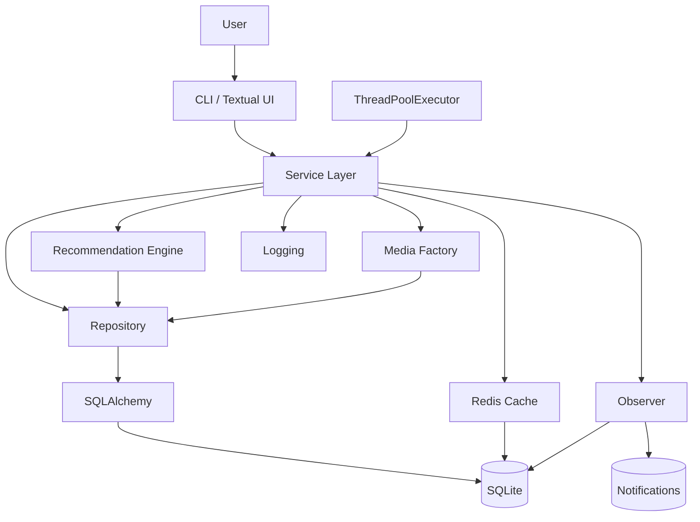

---

# 22. Development Flow

```text
BUILD V1
   ↓
TEST V1
   ↓
ADD LOGGING
   ↓
CREATE MEANINGFUL GIT COMMITS
   ↓
TAG V1.0
   ↓
ADD ONE V2 ENHANCEMENT AT A TIME
   ↓
TEST EACH ENHANCEMENT
   ↓
COMMIT EACH FEATURE
   ↓
INTEGRATE V2
   ↓
TAG V2.0
```

