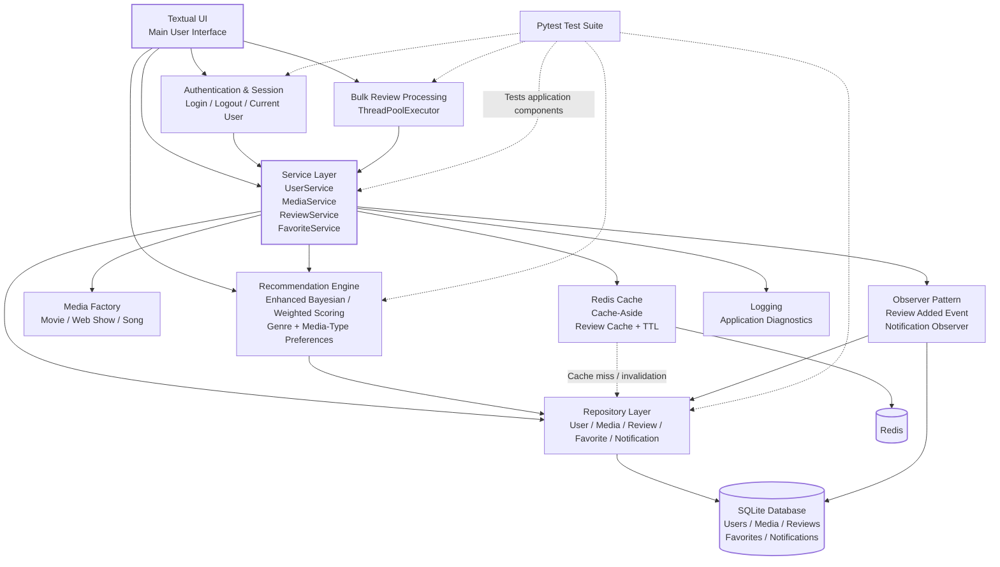
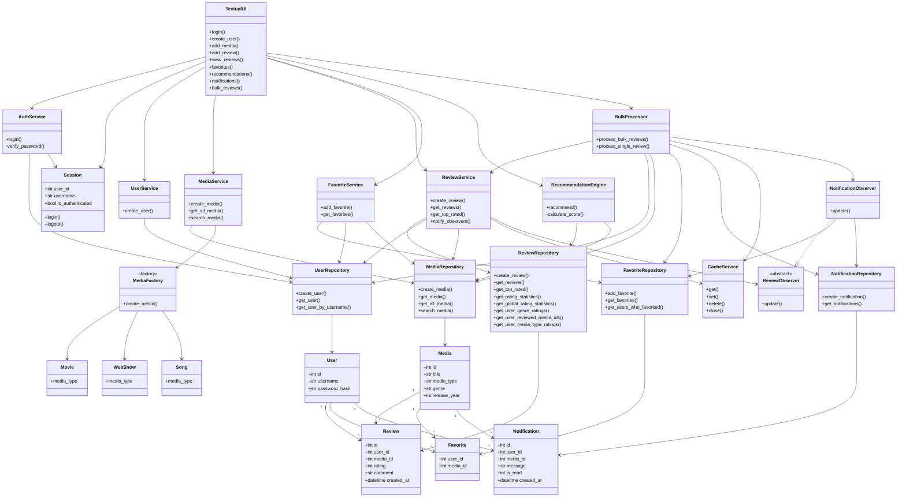

# HLD & LLD Diagrams — Media Review System

This document contains only the two final architecture diagrams for the current V2 Media Review System.

---

# 1. High-Level Design (HLD)

### HLD Flow

**Textual UI → Services → Repository → SQLite**

Supporting components:
- **Authentication & Session** manages the currently logged-in user.
- **Media Factory** creates the appropriate media object.
- **Recommendation Engine** generates recommendations using the enhanced in-house scoring algorithm.
- **Redis** caches frequently accessed media reviews.
- **Observer** creates notifications when a review is added.
- **ThreadPoolExecutor** processes multiple bulk reviews concurrently.
- **Logging** records application and diagnostic events.
- **Pytest** validates the application components.

---

# 2. Low-Level Design (LLD)

### LLD Key Points

- **Repository layer** handles database access through SQLAlchemy.
- **Service layer** contains application/business logic.
- **AuthService** verifies bcrypt password hashes.
- **Session** is an in-memory, per-process session for the logged-in user.
- **MediaFactory** creates `Movie`, `WebShow`, or `Song` objects.
- **ReviewService** coordinates review creation, caching, and observer notifications.
- **CacheService** uses Redis with cache-aside behavior and TTL.
- **NotificationObserver** reacts to newly created reviews and creates notification records for users who favorited the media, excluding the reviewer.
- **RecommendationEngine** uses Bayesian/weighted scoring plus genre and media-type preferences and excludes already reviewed media.
- **BulkProcessor** uses `ThreadPoolExecutor` for multiple CSV review rows, with a separate async database session per worker.
- **TextualUI** is the complete user-facing interface for the final V2 application.
